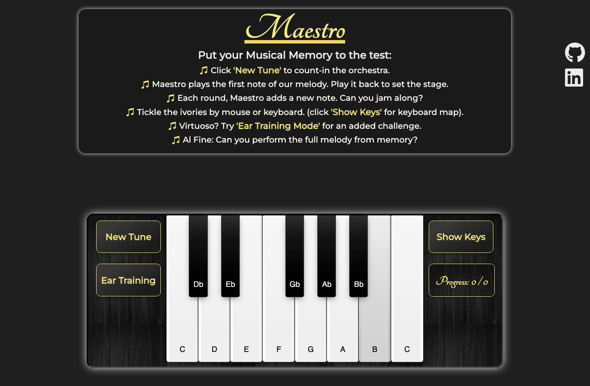

# Etude.js - Musical Memory Game

[Live Link](https://letsgitfunky.github.io/Maestro.js/)

## Background

    Welcome to Etude.js! In this Musical Memory Game, you will hear a series of notes played on the piano and repeat them back.
    Each round adds a new note to the end. Can you remember the whole melody?
    This game features an interactive piano interface created with JavaScript. You can play back the melody using either your mouse or the keyboard.

## Functionality & MVPs
In Etude.js, users will be able to:

-   Interact with a virtual piano keyboard
-   See notes that light up when played by computer and player
-   Hear and repeat various melodies
-   Recognize pitches and get comfortable with piano keyboard layout

In addition, this project will include:

-    High Score tracker: Note Streak
-    Hidden Mode to test your ear
-    Reset button to restart game

## Layout

## Technologies, Libraries, APIs
-    JavaScript for asynchronous game logic
-    Canvas for rendering the piano keyboard
-    Tone.js for generating the musical notes
-    Webpack and Babel for bundling JavaScript modules
-    npm for package management
-    CSS for styling

<!-- If your project needs a backend (see below), list that here as well. -->

## Implementation Timeline

-    ***Friday Afternoon & Weekend:*** Render placeholder keys that are clickable and can produce sounds.
-    ***Monday:*** Start implementing game logic - build note tracker and await user input.
-    ***Tuesday:*** Continue implementing game logic - seed melodies.
-    ***Wednesday:*** Work on styling the application.
-    ***Thursday Morning:*** Add final style touches.

# Bonus Features
After submission this week, some feature that could be added:

-    Tempo Slider: Allow the user to adjust the tempo of the note sequence.
-    Color Scheme Options: Let the user customize the color scheme of the application.
-    Additional Octaves: Expand the range of notes available to the user.
-    Key Signature Selector: Allow the user to select different key signatures for the note sequences.

